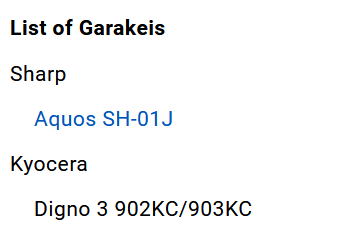

# Your First Pull Request
Do you know how to use github? Can you clone a repository, make some changes, then create a pull request on the repository? Can you fork a repository? If so, you're ready to go.

if you get stuck, need help or clarification, please use our [discussions page](https://github.com/false-fox/garakei-wiki/discussions).

## Step 1. Get Hugo
Hugo is our backend-framework that generates the website from the markdown files. Use our [setting up hugo](/en/contribute/setup/) guide to install hugo (you can stop at "Download repository" if you're following along with this guide)

## Step 2. Make a fork of Garakei Wiki & clone
Fork the garakei wiki into your own repository. This essentially makes a copy that you can modify independently. Then, clone your forked repository into your desktop.

You can modify or add whatever at this point, but i'll be demonstrating how to make a new page. 
## Step 3. Let's create a new page.
Let's create a new page for a new phone, the Sharp Aquos SH-01J. 

First, create a hugo dev server by running `hugo server --theme hugo-book` in the repository's root directory.


**Get the right language**
Garakei Wiki has support for several languages. In the file structure of the wiki, there's  the directory /content/\<langcode>/. The language code is is based off of the ISO 639 two letter standard, english content should go in /content/en/. Make sure links to other pages link to the /en/ version.



Let's see if a page for our manufacturer, Sharp, exists or not, in the /phones/ directory. If it's not, we'll create a new page for Sharp.


Start with making the folder `sharp` and creating a file `_index.md` within it, and we can use the Markdown Frontmatter to add some data Hugo needs.


All wiki pages are formatted with a folder (i.e /sharp/) with an _index.md in it.


```markdown
---
title: "Sharp"
---
# Sharp
Sharp is a Japanese phone company.
```
The `title` element is what will show in the the sidebar, and the folder name will be it's URL path.

Great! Now, let's create a folder for our phone. In the /sharp/ folder, create a new folder called `/aquos-sh-01j/` and an `_index.md` within it.


Titles and directory names should not include the manufacturer's name, just the phone model.


Let's add some data
```md
---
title: "Aquos SH-01J"
---
A cool phone!
```
and it should show up in our sidebar



and sharp & tour phone should be accessible.


## Step 4. Make it pretty.
Now that we know how to set up a new page, let's talk about how to make it pretty. You should read our [standards page](/en/contribute/standards/)

Check out the [Kyocera](/en/phones/kyocera/) and [902KC/903KC](/en/phones/kyocera/Digno%203%2090XKC/) for a good example on how to stylize your pages.

For a good contribution, at minimum Manufacturer pages should have:
- A link to their website,
- A link to a wikipedia page,
- A logo,
- A summary.

And a phone page should have, at least:

- A photo of the phone,
- A summary.
- A list of specs,
- a link to a manual in the language the page is in.

For a phone page to make a great contribution, it should:
- Have tips and insight from your own experiences,
- Information on connectivity to western networks,
- Extending our APK and Connectivity guides (i.e providing phone-specific information),
- Have links to reviews, both positive and negative,
- Have generally detailed information.
- Provide warnings and hints

The phone page should not:
- Repeat information in the introduction, APK guide or connectivity guide, it should link to them.

A few other things to note:
- Images should be public domain, or otherwise usable under fair use
- Links to files (i.e manuals) should have a mirror link to the internet archive

You can use [shortcodes](/en/shortcodes/) to use special elements.

Other collaborators will be able to work with you on changes and modifications.
## Step 5. Ready to send it off!

Once you've tested your pages, you can stage and commit to your forked repository and make a pull request in the Garakei repository. 